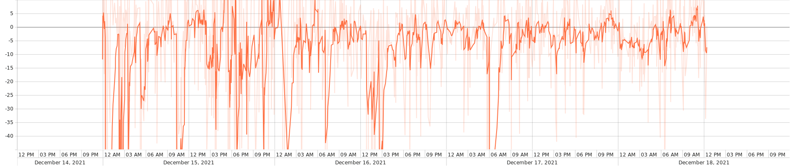
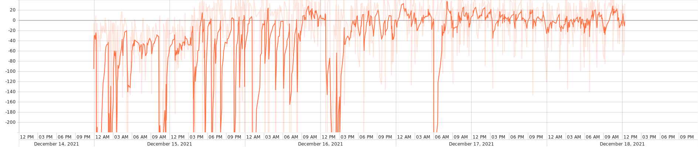
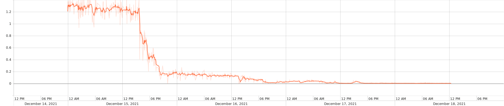

Make sure actual video files are stored in `video_server/video[1-6]`, then run
```
python get_video_sizes
```

Put training data in `sim/cooked_traces` and testing data in `sim/cooked_test_traces` (need to create folders). The trace format for simulation is `[time_stamp (sec), throughput (Mbit/sec)]`. Sample training/testing data we used can be downloaded separately from `train_sim_traces` and `test_sim_traces` in https://www.dropbox.com/sh/ss0zs1lc4cklu3u/AAB-8WC3cHD4PTtYT0E4M19Ja?dl=0. More details of data preparation can be found in `traces/`.

To train a model, run 
```
python multi_agent.py
```

As reported by the A3C paper (http://proceedings.mlr.press/v48/mniha16.pdf) and a faithful implementation一个忠实的实现 (https://openreview.net/pdf?id=Hk3mPK5gg), we also found the exploration factor in the actor network quite crucial for achieving good performance. A general strategy to train our system is to first set `ENTROPY_WEIGHT` in `a3c.py` to be a large value (in the scale of 1 to 5) in the beginning, then gradually reduce the value to `0.1` (after at least 100,000 iterations). 
我们还发现，演员网络中的探索因素对于取得良好的表现非常关键。训练系统的一般策略是首先在一开始将a3c.py中的ENTROPY_WEIGHT设置为一个较大的值(在1到5的范围内)，然后逐渐将该值降低到0.1(在至少100,000次迭代之后)。

The training process can be monitored in `sim/results/log_test` (validation) and `sim/results/log_central` (training).
可以在sim/results/log_test(验证)和sim/results/log_central(训练)中监视训练过程。
 Tensorboard (https://www.tensorflow.org/get_started/summaries_and_tensorboard) is also used to visualize the training process, which can be invoked by running
 Tensorboard也是用来可视化训练过程的，其中可以通过运行调用
```
#python -m tensorflow.tensorboard --logdir=./results/
tensorboard  --logdir=./results/
```
where the plot can be viewed at `localhost:6006` from a browser. 
可以在localhost:6006上从浏览器查看图。
Trained model will be saved in `sim/results/`. We provided a sample pretrained model with linear QoE as the reward signal. It can be loaded by setting `NN_MODEL = './results/pretrain_linear_reward.ckpt'` in `multi_agent.py`.
训练后的模型将保存在sim/results/中。我们提供了一个用线性QoE作为奖励信号的样本预训练模型。它可以通过设置NN_MODEL = './results/pretrain_linear_reward.ckpt来加载。在multi_agent.py 。
#### Training Curve 训练曲线using tensorboard
TD Loss: 
Total Reward: 
Avg Entropy: 
